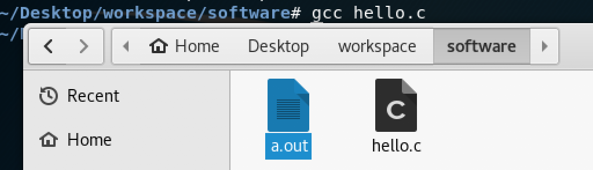
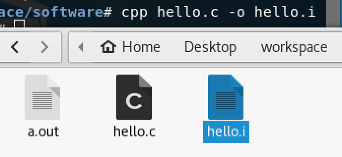
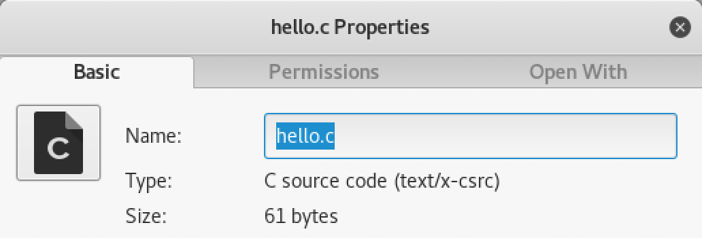
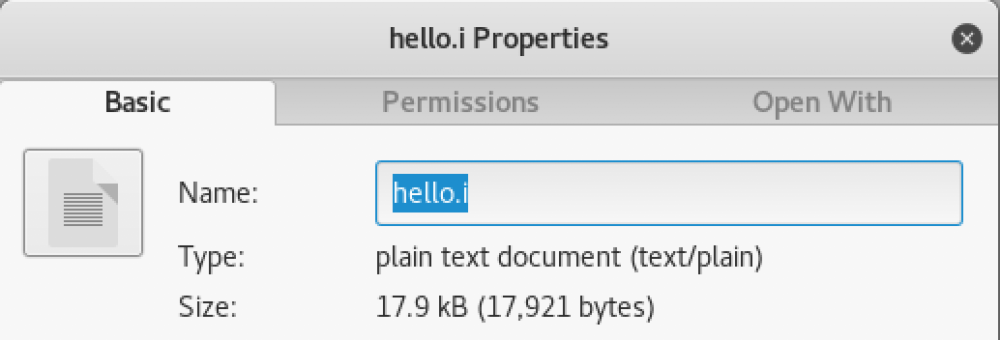
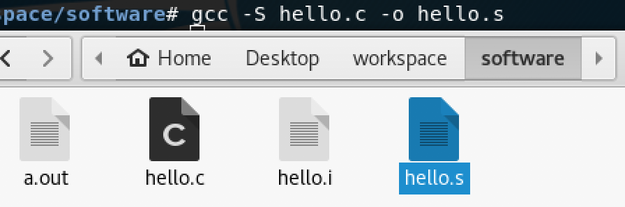
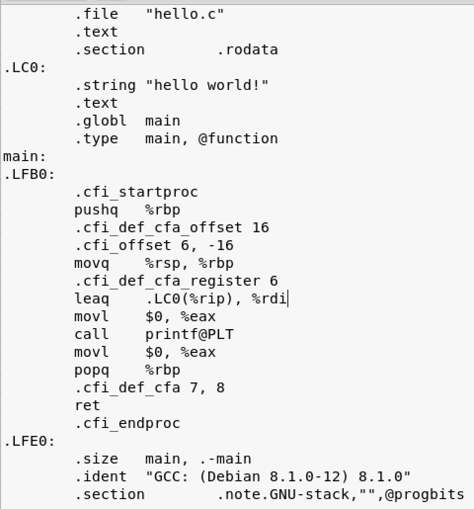
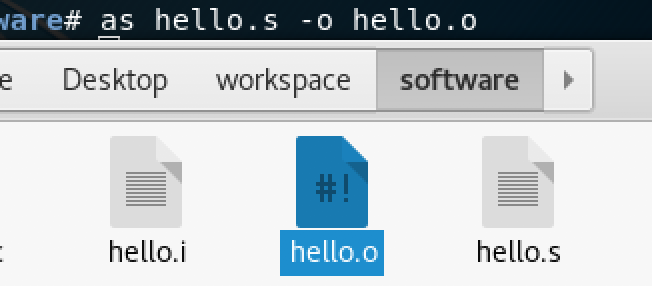

## 软件项目开发安全周期 相关概念梳理

### 软件项目开发简介

1947年，冯诺伊曼首先提出了用流程图描述计算机的运行过程，于是才出现了不同于研制硬件的另一种工作——程序设计。现在，计算机和网络以微电子等为基础，作为载体成为软件的舞台。

软件开发大致经历了以下几个时期：

* 个人程序时期（1947年-1950年代末，硬件昂贵，软件作为硬件附属，主要是用机器语言和汇编语言进行开发）
* 软件作坊时期（1960年代初-1960年代末，多人分工合作共同完成一个程序的编制，对项目的开发进行管理，出现不少高级程序设计语言如FORTRAN、COBOL等IBM、DEC等发布了划时代的系列机，不同机型具有相同或相似的指令集和操作系统，可以做到彼此兼容，同一程序在多个机器上都可以运行）
* 软件工程时期（1970年代初至今，软件的规模和复杂性随着计算机领域的发展不断提升，但是出现了“软件危机”：开发成本难控制、周期拖长、可维护性差、可靠性低等等，因此提出了软件工程的概念，倡导以工程的原理、原则和方法进行软件开发、指导软件维护，从而解决软件危机。）

软件开发的本质是**实现问题域中的概念和处理逻辑到运行平台的概念和处理逻辑的映射**，比如在需求分析时用面向对象的方法进行数据抽象、行为抽象，形成计算的客体或可构造的计算逻辑。**建模**是解决问题的一般途径，也是实现映射的基本手段，也就是运用知识、通过抽象，给要求解的问题一个结构。

**软件生存周期(SDLC）**则是指软件产品或系统的一系列活动的全周期，包括形成概念、开发、交付使用、修订和演化，即从产生直到报废的周期。根据百度，“周期内有问题定义、可行性分析、总体描述、系统设计、编码、调试和测试、验收与运行、维护升级到废弃等阶段，这种按时间分程的思想方法是软件工程中的一种思想原则，即按部就班、逐步推进，每个阶段都要有定义、工作、审查、形成文档以供交流或备查，以提高软件的质量。但随着新的面向对象的设计方法和技术的成熟，软件生命周期设计方法的指导意义正在逐步减少”。

GB/T 8566-2007《信息技术 软件生存周期过程》标准为软件生存周期过程建立了公共框架，以供软件产业界使用。包括了在含有软件的系统、独立软件产品和软件服务的获取期间以及在软件产品的供应、开发、运行和维护期间需应用的过程、活动和任务。该标准把软件生存周期中可能执行的活动分为5个基本过程、9个支持过程和7个组织过程：

* 5个基本过程：
	* 获取过程：为需方而定义的活动，启动，招标，合同，对供方监督，验收等
	* 供应过程：为供方而定义的活动，启动，准备投标，签订合同，编制计划，执行，交付和完成
	* 开发过程：为开发方而定义的活动：需求、设计、编码、测试、安装、验收
	* 运作过程：为操作方而定义的活动：运行测试，系统运行，用户支持
	* 维护过程：为维护方而定义的活动：问题和修改分析，修改实现，维护评审/验收，迁移，软件退役

* 9个支持过程：
	* 文档编制过程
	* 配管管理过程
	* 质量保证过程
	* 验证过程：确定软件产品是否满足在以前的活动中施加于它们的要求和条件的过程。合同验证，过程验证，需求验证，设计验证，编码验证，集成验证，文档验证
	* 确认过程：确定需求和最终的、已建成的系统或软件产品是否满足特定的预期用途的过程。
	* 联合评审过程：评价某个项目的一项活动的状态和产品，项目管理评审，技术评审
	* 审核过程：在适当时确定与需求、计划和合同的符合性
	* 问题解决过程
	* 易用性过程

* 7个组织过程：

	* 管理过程：为生存周期过程中的管理包括项目管理而定义的基本活动
	* 基础设施过程：为建立生存周期过程基础结构而定义的基本活动
	* 改进过程
	* 人力资源过程
	* 资产管理过程
	* 重用大纲管理过程：为组织的重用大纲主管而定义的活动，启动，领域评估，重用评估，策划，执行和控制，评审和评价
	* 领域工程过程：领域工程师的活动和任务，领域分析，领域设计，资产供应，资产维护

### 软件安全性测试

* 验证软件安全性需求都有相应的软件安全性测试对应
* 每个软件安全性需求都通过一个或多个测试得到满足
* 通过测试分析和软件实现对相关发现进行评估
* 判断给出的软件安全性测试已充足
* 确定软件安全性测试规程
* 整理、分析测试数据
* 重新测试失败的系统需求
* 编写软件安全性测试报告

软件安全性不同于软件可靠性。在GJB/Z 102《软件可靠性和安全性设计准则》与GJB/Z 102A《军用软件安全性设计指南》中，对软件安全性的定义为：软件运行不引起系统事故的能力。而对软件可靠性的定义为：在规定的条件下和规定的时间内，软件不引起系统失效的能力。软件可靠性不仅与软件存在的缺陷有关，而且与系统的输入和系统使用有关。

主要的区别就在于安全性关注“事故”而可靠性关注“失效”。系统失效可能会引起事故，但事故不只是由系统失效引起。失效的含义是和已有需求的偏离，系统规定了需求，而运行与需求偏离，就产生了“失效”。关键在于，失效的前提是需求已经定义，如果需求没有定义某个行为，而系统恰好运行到这里，这时这个结果可能引起不安全的后果，也可能没什么影响，情况不一定。这就是事故由非失效引起的原理。

* 软件存在错误，偏离需求，后果不严重，软件不可靠但安全；
* 软件存在错误，偏离需求，后果很严重，软件不可靠不安全；
* 软件不存在错误，未偏离需求，后果很严重，软件可靠不安全；


### 编译和链接

在软件的开发阶段，代码必然会经过编译和链接的过程。

由编译原理课程中所学可知，可将编译过程分为前端和后端，整个过程包括词法分析、语法分析、语义分析、中间代码生成、中间代码优化、目标代码生成等。前端将代码转化为语法树、三地址码等中间代码，独立于具体的硬件（即与目标机器和运行时环境无关），而后端将中间代码转换为目标机器代码。跨平台的编译器在不同的平台中可以使用同一个前端和不同后端。链接的主要内容则是处理好各个模块之间的相互引用、正确衔接各个模块，包括了地址和空间分配、重定位、符号决议或绑定。

以linux平台的gcc举例，它完成了预处理、编译、汇编和链接的过程。

#### 编译器 

* 以Linux平台的gcc为例。编写一个简单的helloworld程序

```bash
// hello.c
#include <stdio.h>
int main(){
    printf("hello world!\n");
}
```

```bash
gcc hello.c # 编译
./a.out # 执行
hello world!
```



可以将以上看似简单的编译过程分解成如下步骤：

* 预处理

```bash
cpp hello.c -o hello.i
```



可以看出经过预编译的文件变大了很多:





* 编译：将预处理之后的程序转换成特定汇编代码
 
```bash
gcc -S -o hello.s
```
其中-S让编译器在编译之后停止，不进行后续的过程。





* 汇编：将上一步的汇编代码转换成机器码，生成二进制格式的目标文件。

```bash
as hello.s -o hello.o
```



* 链接：将多个目标文件和所需的库文件相连接，形成最终的可执行文件。

* 可以用makefile指明工程中的哪些源文件需要编译以及如何编译、需要创建哪些库文件以及如何创建这些库文件、如何最后产生我们想要的可执行文件。

```bash
makefile：		【描述符块 target ：dependencies】
first.dll: dll.obj exp.def
link.exe /DEF:exp.def /DLL /OUT:first.dll dll.obj

dll.obj:dll.c
cl.exe /nologo /c dll.c

clean:
del first.dll dll.obj first.lib exp.def
```

手动编译文件而不是直接使用更便捷的集成开发环境，有助于更加彻底地掌控项目结构，减少不安全因素。

### 杀毒软件

杀毒软件通常集成监控识别、病毒扫描和清除、自动升级和主动防御等功能，有的杀毒软件还带有数据恢复功能，是计算机防御系统（包含杀毒软件，防火墙，特洛伊木马和其他恶意软件的查杀程序，入侵预防系统等）的重要组成部分，是用于消除电脑病毒、特洛伊木马和恶意软件等计算机威胁的一类软件。

杀毒软件又称反病毒软件。反病毒软件的任务是实时监控和扫描磁盘。部分反病毒软件通过在系统添加驱动程序的方式，进驻系统，并且随操作系统启动。大部分的杀毒软件还具有防火墙功能。反病毒软件的实时监控方式因软件而异。有的反病毒软件，是通过在内存里划分一部分空间，将电脑里流过内存的数据与反病毒软件自身所带的病毒库（包含病毒定义）的特征码相比较，以判断是否为病毒。另一些反病毒软件则在所划分到的内存空间里面，虚拟执行系统或用户提交的程序，根据其行为或结果作出判断。

现实的杀毒软件大多是通过静态特征，比如hash值，来识别已知恶意软件的，因为求hash值的过程快。实时性对于杀毒软件而言非常重要，且这样的方法误报率几乎为0，只是漏报率非常高，比如由于hash的脆弱性，软件只要重新编译hash值就会变得不同。

恶意代码也可以通过多态变形来反检测。我们将使用通常的特征码扫描法无法检测（或者极其难以检测）的病毒称为多态病毒。多态病毒避免被检测的方法主要有两种：使用不固定的密钥或者随机数加密病毒代码，或者在病毒运行的过程中改变病毒代码，除了这两种主要的方式外，还有的病毒，例如“Bomber”通过一些奇怪的指令序列等方法可以实现多态性。

应对类似于这种运行时改变的方式可以通过判断控制流图、数据流图、系统调用等来实现。

例如，总体架构如下：

* 蜜罐捕获（还有云查杀、干网流量抓取等）--> 样本人工分析 --> 分类 --> 对攻击性的恶意软件进行特征提取 --> 更新各个客户端和边界防护终端的病毒数据库 --> 客户端软件进行防御

* 运行时数据 --> 不同粒度：模块、系统调用、分支跳转、指令…… --> 综合应用 切分：已经分析过的模块不用分析、API内部代码不用分析
* 系统级调试器或钩子之类的跟踪API调用（改导入表或API增加记录功能）
	* API Hook
	* SSDT Hook（前两个攻击用得多 用于隐藏）
	* INT Hook（成熟 最底层 有官方工具）
	* Windbg 

#### 调试器

在进行获取程序运行的控制流图、记录API调用等过程中，少不了调试器的身影。

以windows平台为例，windbg用于开发系统级程序时的调试。

注意，.pdb结尾的文件是一个程序数据库文件，保存着调试和项目状态信息，使用这些信息可以对程序的调试配置进行增量链接。pdb文件包含了编译后程序指向源代码的位置信息，即高级代码和二进制代码之间的关联，用于调试的时候定位到源代码，主要是用来方便调试，有一套完整的源代码，所以在发布release版本时要注意删除、不要轻易拷给他人。

Linux下调试器拥有一个瑞士军刀般的工具，就是ptrace系统调用。这是一个功能众多且相当复杂的工具，能允许一个进程控制另一个进程的运行，而且可以监视和渗入到进程内部。[调试器工作原理](https://www.cnblogs.com/alantu2018/p/8997173.html)

常用的软中断包括int1（相当于F10, trapflag）和int3。软中断是利用硬件中断的概念，用软件方式来模拟、实现宏观上的异步执行效果，通常是硬中断服务程序对内核的中断，而与之相对的硬中断是外部设备对CPU的中断。内核的内存区存在几个重要的数据结构。

一些逆向工具比如Olly dbg，就是基于Microsoft提供的让程序员自己开发调试器的逻辑。IsDebuggerPresent()可以反逆向，当然调试器也可以去修改这一代码。它是根据中断向量表来判断调试器是否存在的。中断向量表是指中断服务程序入口地址的偏移量与段基值，按照中断类型号从小到大的顺序存储对应的中断向量，在中断响应过程中，CPU通过从接口电路获取的中断类型号计算对应中断向量在表中的位置，并从中断向量表中获取中断向量，将程序流程转向中断服务程序的入口地址，执行相应处理。软中断是软件和硬件配合完成的，查表的过程并非硬件自动完成，而是由守护线程来检测中断寄存器、判断是否有软中断、查询中断向量表调用相应的服务程序。


#### shellcode

shellcode是软件攻防的入口性代码，很多系统级别的软件攻防都是以shellcode为起始的。比如webshell一般作为数据发送给服务端造成溢出。

shellcode的编写语言很难说哪个是最适合的，但如果使用汇编可以便于达成完全的控制，比如系统寄存器的操作、系统进程相关的内部数据结构、使用机器指令裸代码进行操作等。

```bash 
//shellcode举例
_asm
	{
		MOV EAX, DWORD PTR FS : [0x30]//; 获取PEB基址
		MOV EAX, DWORD PTR DS : [EAX + 0xC]//; 获取PEB_LDR_DATA结构指针
		MOV ESI, DWORD PTR DS : [EAX + 0x1C]//; 获取InInitializationOrderModuleList成员指针
		LODS DWORD PTR DS : [ESI]//; 把ESI地址里的值给EAX，同时ESI自己加4，相当于获取下一个节点
		MOV EBX, DWORD PTR DS : [EAX + 8]//; 取其基地址，该结构当前包含的是kernel32.dll
		MOV dwKernelBase, EBX
	}
```	

既然希望shellcode的地址覆盖返回地址，在溢出后即可跳转到自己编写的代码中以获取权限，而shellcode在内存中的地址并不固定，因此可以利用系统的DLL文件中的JMP ESP或CALL ESP、CALL EBP来实现对shellcode地址的间接跳转。这样有两个好处，一是不必准确定位shellcode的地址；二是可以防止strcpy对00字节的截断，因为DLL文件中，地址一般为7FXXXXXX。

同时还需要解决API地址定位的问题。自行获得系统函数的地址并进行调用，首先需要知道GetProcAddr的地址，其它都可以获得。关键在于了解Windows DLL映像文件（即PE文件）的格式，通过搜获函数Export表获取API地址。自行定位kernel32.dll地址等。

几乎所有的shellcode都必须进行这样的操作，所以才有规律可循。shellcode的识别以libemu为例，它是一款用C语言实现的基于x86的shellcode检测的库，它的基本假设就是，如果字串是一段shellcode，那么其中一定包含”call”（0xe8）或者“fnstenv”（0xd9）指令（GetPC code）。可见可以通过shellcode中进行地址定位的指令对shellcode进行识别。当然，也可以利用人工智能（机器学习、自然语言处理）的方式来对shellcode进行识别判断。

#### 移动终端应用

* **关键代码定位**：在本学期的移动互联网安全中讲到了代码注⼊法和栈跟踪法。对Andriod平台而言，代码注入法是通过修改apk文件的smali反汇编代码，加入打印语句输出变量和关键数据结构的状态。栈跟踪法的基本原理是在smali文件中加入输出运行时的栈跟踪信息，然后查看栈上的函数调用序列来理解方法的执行流程。

* [移动终端应用逆向分析](https://sec.cuc.edu.cn/huangwei/textbook/mis/chap0x07/exp.html) 简单的两个破解思路（对判断语句进行修改：if-eqz改成if-nez以及adb logcat输出关键信息）完全可以推广到其它的破解中。“插桩”就是在保证被测程序原有逻辑完整性的基础上在程序中插入一些探针，进行信息采集。

* 重签名的过程需要用到签名证书对应的私钥，所以作为应用程序的开发者，必须保护好自己的私钥，避免泄漏。


